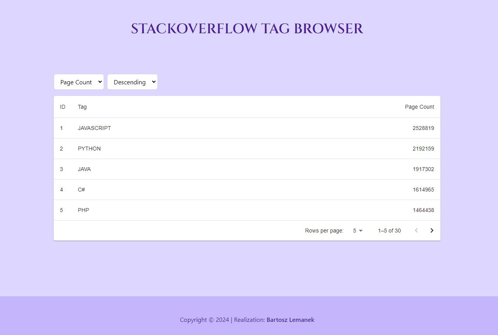

# StackOverflow Tag Browser

**StackOverflow Tag Browser** is a tag browsing application that allows you to browse and sort popular tags from StackOverflow.

## Features:

- Browse popular tags from StackOverflow.
- Sort tags by page count or ID.
- Automatic error handling when fetching data from the API.

## How to Use:

1. Launch the application.
2. Browse the list of tags.
3. Use the sorting control to sort tags by page count or ID.

## Technologies:

- React.js
- Material-UI
- TypeScript

## Installation:

1. Clone the repository to your local machine.
2. Run `npm install` in the project's root directory.
3. Run `npm run dev` to start the application locally.

## Screenshots:

## Author:

- Bartosz Lemanek
